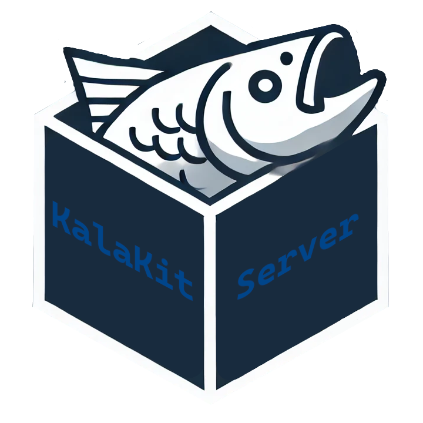

# KalaServer

KalaServer is a lightweight C++ 20 library for Windows (no Linux support of any kind) that allows you to make web, media or any other kind of a server with very few dependencies. The library is currently in early alpha development, so a lot of changes will come, but the core goals will stay the same. Track development and future plans on the public [trello board](https://trello.com/b/Xrf2qRDD/kalaserver) board.

---

## Links

[Donate on PayPal](https://www.paypal.com/donate/?hosted_button_id=QWG8SAYX5TTP6)

[Official Discord server](https://discord.gg/jkvasmTND5)

[Official Youtube channel](https://youtube.com/greenlaser)

---

## Docs

[How to build from source](docs/build_from_source.md)

[External libraries](docs/external_libraries.md)

[Lost Empire Entertainment and KalaKit ecosystem](docs/ecosystem.md)
