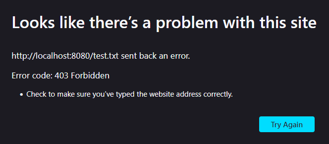
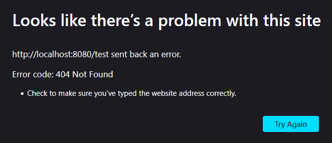

# KalaServer

KalaServer is a lightweight C++ 20 library for Windows that allows you to make an HTTP server locally for websites using Windows sockets.

---

# Future plans

## General

- MIME Types
- Threading (new thread per user)
- Range Requests and persistent connections (for large media or when serving multiple assets)
- GUI for server (useful server info and interactions)

## For global access

- limit brute-force attempts by throttling per-second and per-minute requests for current ip
- additional security with openssl:
	- https encryption
	- tls handshake
	- certificate handling + client sertificate verification
	- cypher suite selection
	- protocol version restrictions
	- perfect forward secrecy
	- secure session reuse
- authorization:
	- session tokens
	- password hashes
	- account data stored on disk
- each route as struct with auth-level as enum, route as string and mimeType as string

---

# Prerequisites (when compiling from source code)

- Visual Studio 2022 (with C++ CMake tools and Windows 10 or 11 SDK)
- Ninja and CMake 3.30.3 or newer (or extract Windows_prerequsites.7z and run setup.bat)

To compile from source code simply run 'build_all.bat' or 'build_debug.bat' or 'build_release.bat' depending on your preferences.

---

# How to use

Compile the project from source using the existing CMakeLists.txt at root by running 'build_all.bat' and then open 'KalaServer_example.exe' inside 'build-release/example' or 'build-debug/example' to start the example server made with KalaServer.

how to get access locally:
- local port: 8080
- local website: http://localhost:8080/
- firewall: enable private, disable public

---

# Displayed errors

KalaServer correctly displays errors on your browser and sends 500, 403 or 404 when either of those are errors are encountered on the server.

